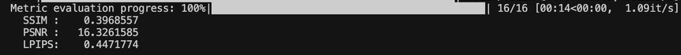

# dji-footage-gaussian-splatting-vipe

Link to google drive with vide of end-to-end run and final .ply: 

Automated pipeline that takes a video, reconstructs camera poses with [ViPE](https://github.com/nv-tlabs/vipe), trains a [3D Gaussian Splatting](https://github.com/graphdeco-inria/gaussian-splatting) model, and evaluates the result.

## Dataset Preparation

Before running the pipeline, convert your image sequence to video locally (on macOS/Windows). On Linux, `ffmpeg` was producing a video with only the first frame, and no solution was found to handle that on instance.

Run this on your local machine:

```bash
ffmpeg -y -framerate 6 -pattern_type glob -i 'zavod70/dji_*_v.jpg' \
  -vf "scale=-2:1080" -c:v libx264 -pix_fmt yuv420p \
  -g 6 -preset fast -crf 18 output.mp4
```

Adjust the glob pattern (`zavod70/dji_*_v.jpg`) and output filename (`output.mp4`) to match your dataset. Then upload `output.mp4` to the server.

## Pipeline Overview

```
input video ──► ViPE (SfM) ──► COLMAP format ──► GS Training ──► Render ──► Metrics
                  │
                  └──► Viser visualization (optional)
```

`make install` installs Miniconda, clones repos, creates `vipe` and `gaussian_splatting` conda envs with all dependencies.

`make vipe` runs ViPE Lyra pipeline on the video, exports SLAM map, converts to COLMAP sparse format.

`make visualize` launches Viser viewer on port 8888 to inspect the ViPE reconstruction.

`make train` trains 3DGS for 20k iterations with anti-aliasing and eval split.

`make render` renders train/test views from the trained model.

`make metrics` computes PSNR, SSIM, LPIPS on rendered vs ground-truth images.

`make all` runs vipe, train, render, and metrics sequentially.

`make clean` removes cloned repos, results, and conda environments.

## Quick Start

```bash
# Install everything
make install

# Run full pipeline
make all
```

### Key Variables

Also you can change variables inside Makefile.

`VIDEO` (default `/root/gaussian-splatting/output.mp4`) path to input video.

`SEQUENCE` (default `output`) sequence name used in COLMAP output.

`RESULT_DIR` (default `./results`) directory for trained model and renders.

## Makefile Structure

The Makefile uses two separate conda environments to isolate dependencies:

`vipe` is the Python environment for ViPE (camera pose estimation, COLMAP conversion, Viser visualization). `gaussian_splatting` is the Python environment for 3DGS (training, rendering, metrics), includes custom CUDA kernels (`diff-gaussian-rasterization`, `simple-knn`).

## Results

### Viser (Interactive 3D Viewer)


### Render


### Camera Paths


### Metrics



Project is authored by Bohdan Prokhorov.